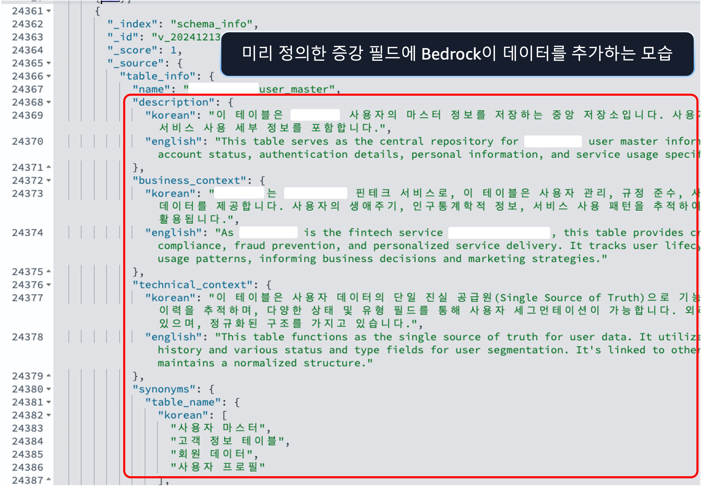
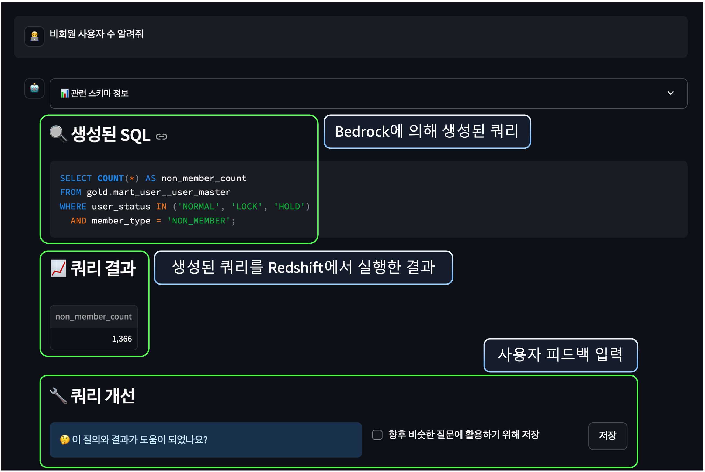

# Text2SQL QuickStart
이 프로젝트는 Redshift, OpenSearch, Bedrock을 활용한 Text-to-SQL 시스템을 빠르게 시작할 수 있도록 설계되었습니다. 아래 단계를 따라 환경을 설정하고 실행하세요.
## Prerequisites
- **AWS 계정**: AdministratorAccess 권한을 가진 IAM 사용자 추천.
- **AWS CLI**: 설치 및 설정 완료 (`aws configure` 실행).
- **Python**: 3.8 이상 버전.
- **필수 패키지**: `requirements.txt`에 명시된 의존성 설치 필요.
- **CloudFormation 템플릿**: `cloud-formation/template.yaml` 파일 준비.
- **SSH 키 페어**: EC2 접속을 위해 키 페어 생성 필요.
  - 생성 방법:
    ```bash
    aws ec2 create-key-pair --key-name my-key-pair --query 'KeyMaterial' --output text > my-key-pair.pem
    chmod 400 my-key-pair.pem
    ```
  - 생성 후 `my-key-pair.pem` 파일을 안전하게 보관.
## Execution Steps
### Provision AWS Resources
AWS 리소스를 배포하려면 다음 단계를 따르세요.
#### 1. Redshift + OpenSearch 배포
Redshift 클러스터와 OpenSearch 도메인을 CloudFormation으로 배포합니다.
* 템플릿 파일: `text2sql-quickstart/cloud-formation.yaml`
* 배포 명령어:
```bash
aws cloudformation create-stack \
  --stack-name Text2SQLStack \
  --template-body file://cloud-formation/template.yaml \
  --parameters \
    ParameterKey=MasterUserPassword,ParameterValue=<YourPass123> \
    ParameterKey=OpenSearchMasterPassword,ParameterValue=<YourOpenSearchPass123> \
    ParameterKey=EC2KeyPair,ParameterValue=<my-key-pair> \
  --region ap-northeast-2 \
  --capabilities CAPABILITY_NAMED_IAM
```
Password는 최소 8자 이상, 대문자/소문자/숫자를 포함해야 합니다(예: YourPass123).
배포는 약 10~15분 소요되며, 진행 상황은 AWS Management Console의 CloudFormation에서 확인 가능합니다.
* 출력값 확인:
```bash
aws cloudformation describe-stacks --stack-name Text2SQLStack --query "Stacks[0].Outputs"
```
1. `RedshiftClusterEndpoint`: Redshift 연결 엔드포인트 (예: my-redshift-cluster.xxx.ap-northeast-2.redshift.amazonaws.com:5439).
2. `RedshiftDatabaseName`: Redshift 데이터베이스 이름 (예: text2sql).
3. `RedshiftUsername`: Redshift 마스터 사용자 이름 (예: admin).
4. `OpenSearchEndpoint`: OpenSearch 엔드포인트 (예: https://search-text2sql-opensearch-xxx.ap-northeast-2.es.amazonaws.com).
5. `OpenSearchUsername`: OpenSearch 마스터 사용자 이름 (예: admin).
6. `LoadBalancerDNS`: ALB DNS 이름 (애플리케이션 접속용).

#### 2. OpenSearch 도메인에 `analysis-nori` 플러그인 추가

`analysis-nori` 플러그인은 한국어 텍스트 분석을 지원하며, OpenSearch 도메인에서 기본 설치되지 않습니다. 아래 단계로 수동 추가하세요.

#### Prerequisites
- OpenSearch 도메인이 `Active` 상태일 것.
- AWS 콘솔 접근 권한 (`es:AssociatePackage` 포함).

#### Steps
1. **AWS 콘솔 접속**:
   - OpenSearch Service → `Text2SQLStack`의 OpenSearch 도메인 선택.

2. **Packages 탭 이동**:
   - 도메인 상세 페이지에서 "Packages" 탭 클릭.

3. **`analysis-nori` 연계**:
   - "Associate package" 버튼 클릭.

4. **상태 확인**:
   - 블루/그린 배포 완료까지 대기 (몇 분 소요).
   - "Packages" 탭에서 `analysis-nori`의 "Association status"가 `Active`로 변하면 완료.

#### 3. Bedrock 파운데이션 모델 활성화
Bedrock의 Foundation Model은 자동으로 활성화할 수 없습니다. 다음 단계를 따라 필요한 모델을 활성화 하세요.
* AWS 콘솔에서 모델 활성화:
1. AWS Management Console에 로그인.
2. Bedrock 서비스로 이동 → "Model access" 선택.
3. 다음 모델들을 활성화:
    * Anthropic Claude 3.5 Sonnet (`anthropic.claude-3-5-sonnet-20240620-v1:0`)
    * Amazon Titan Embed Text V2 (`amazon.titan-embed-text-v2:0`)
    * APAC Anthropic Claude 3.5 Sonnet (`apac.anthropic.claude-3-5-sonnet-20240620-v1:0`)
4. 각 모델 옆의 "Enable" 버튼을 클릭.
5. 승인 후(즉시 또는 몇 분 소요) 모델 사용 가능.

### Other preparations

#### 1. Sample Schema + Sample Queries
* 위치: `sample-data/multi_database_schema.json` 파일에 Redshift 테이블(users, transactions)의 스키마 정의 포함.
* 사용: Text2SQL 모델이 테이블 구조를 이해하는 데 필요.
* 샘플 스키마와 쿼리들은 애플리케이션이 실행되면 업로드가 가능하므로 하단의 Execution Examples을 참조.

### Execution Examples
1. 애플리케이션 접근

2. 스키마 입력

3. 증강 데이터 예시

4. 쿼리 생성을 위한 자연어 입력

5. 쿼리 생성 및 실행 결과 확인

### 

# Security

See [CONTRIBUTING](CONTRIBUTING.md#security-issue-notifications) for more information.

# License

This library is licensed under the MIT-0 License. See the LICENSE file.

